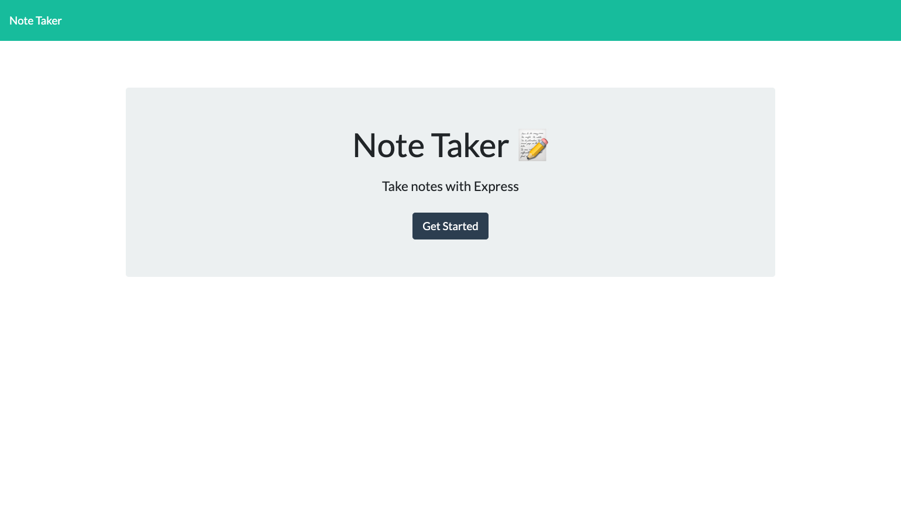
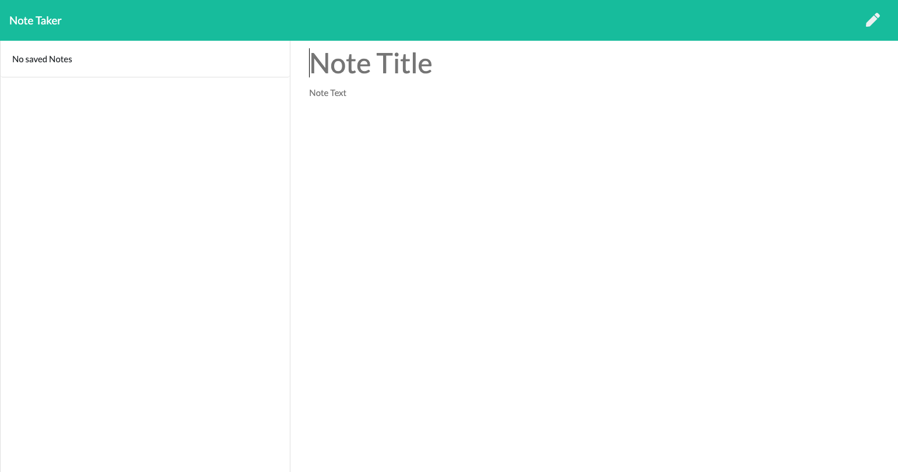
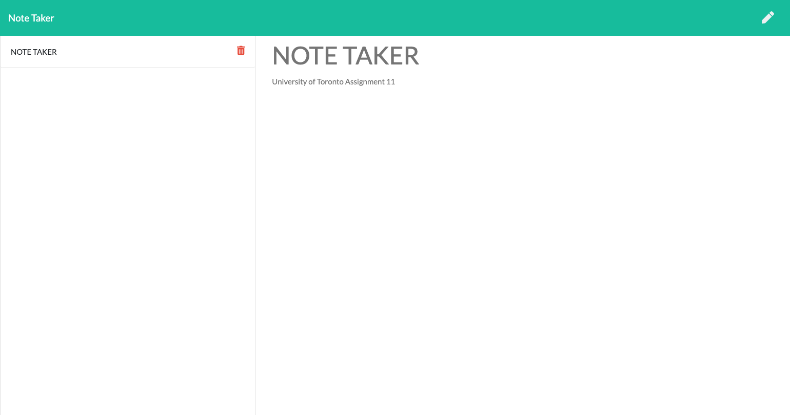

# Note Taker
Note Taker that can be used to write and save notes. This application will use an Express.js back end and will save and retrieve note data from a JSON file.

# Installation

How to install :

Note Taker APP is deployed to Heroku here: https://neeko2021notetaker.herokuapp.com/
If choosing to use from terminal, open terminal and run(make sure you have install npm i express).
node server.js 
Then in browser, search localhost:3001

# Note Taker Information
- GET /notes should return the notes.html file.
- GET * should return the index.html file.
- GET /api/notes should read the db.json file and return all saved notes as JSON.
- POST /api/notes should receive a new note to save on the request body, add it to the db.json file,  and then return the new note to the client.
- DELETE /api/notes/:id should receive a query parameter containing the id of a note to delete. 

# Screenshot

# Question

Please contact my email if you have any questions.
neeko_tvxq@hotmail.com
